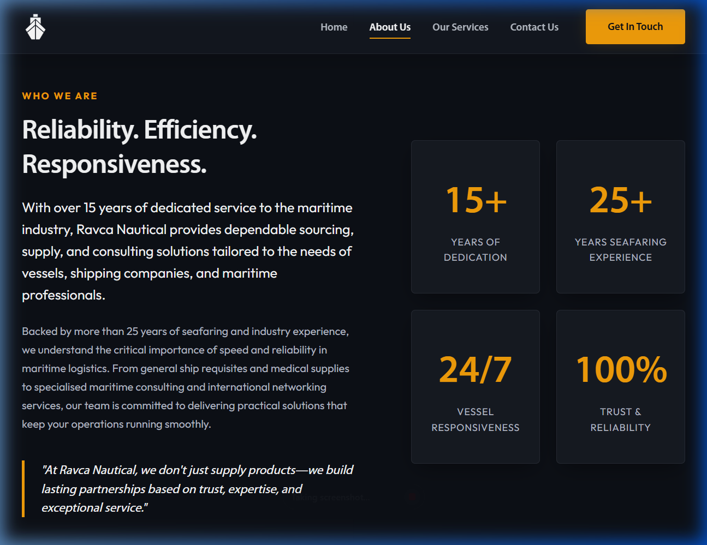
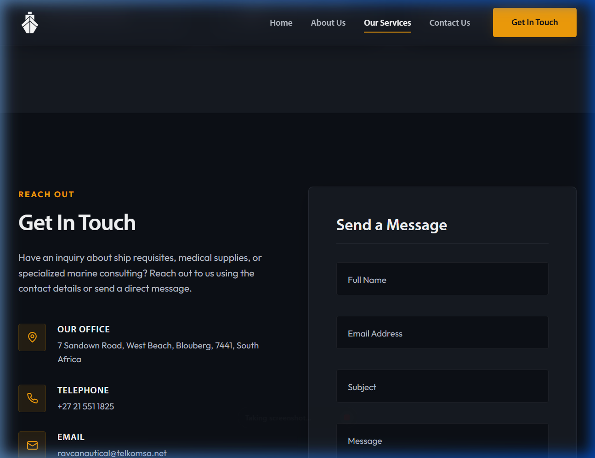

# Ravca Nautical Landing Page

A premium, single-page corporate website for **Ravca Nautical**, a trusted maritime supply and consulting partner. Developed with a high-contrast dark theme, modern typography, custom font integrations, and fully mobile-responsive elements.

---

## 1. Visual Previews & Layout

### Hero Section
The landing page opens with a full-screen high-resolution cover image of a vessel, overlayed with a deep ocean blue gradient. The custom navigation bar is semi-transparent with a glassmorphism blur effect and features the white Ravca Nautical logo.

### About Section
A two-column section showing corporate stats on the right (with soft glass-like card borders and hover lift transitions) and a credentials quote section on the left.

### Our Services Section
Displays three detailed columns representing general supplies, medical requisites, and maritime consulting. Each card utilizes modern hover zoom scales on images, custom gold icons, and rounded bullet points lists.

### Contact Us Section & Form
Includes floating input labels that scale up on focus, direct input validation alerts, and an overlay success screen when sent.

---

## 2. Technical Features

- **Custom Typography**: Loaded the local `MYRIADPRO-REGULAR.OTF` and `MYRIADPRO-SEMIBOLD.OTF` fonts via `@font-face` rules. Configured standard modern fallback typography with Google Fonts `Outfit`.
- **Dark Mode Design System**: Established deep HSL color tokens for the background surface (`#0b0d12`) and gold accents (`#f29900`) matching maritime safety signaling.
- **Responsive Layout**: Handled media queries for mobile viewports, including a collapsible hamburger navigation menu on smaller screens.
- **Client-Side Form Validation**: Added field validation alerts on focus/blur and a spinner-to-success animation on form submission.
- **SEO Best Practices**: Inserted semantic HTML5 layout tags, OpenGraph cards, schema viewport descriptors, and target link unique IDs.
